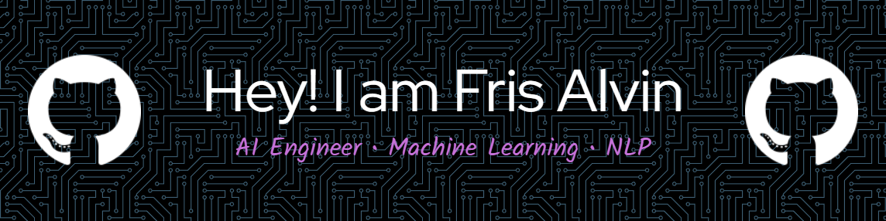

<!-- ==================== BANNER ==================== -->

  

<h1 align="center">Fris Alvin</h1>
<h3 align="center">AI Engineer • Machine Learning • NLP Specialist</h3>

  Bachelor’s Degree in Informatics – Universitas Dian Nuswantoro  
  Passionate about Artificial Intelligence, Deep Learning & Intelligent Systems

---

## 🧠 AI & Machine Learning

  
  
  
  

---

## ⚙ Frameworks & Deployment

  
  
  

---

## 💾 Database

  

---

## 💻 Programming Languages

  
  
  
  
  
  
  
  
  

---

## 🎨 Design Tools

  
  

---

## 🌐 Connect With Me

&nbsp;&nbsp;&nbsp;

&nbsp;&nbsp;&nbsp;

## 🐍 Contribution Animation

<picture>
  <source media="(prefers-color-scheme: dark)" srcset="https://raw.githubusercontent.com/frisalvin/frisalvin/output/snake-dark.svg">
  <source media="(prefers-color-scheme: light)" srcset="https://raw.githubusercontent.com/frisalvin/frisalvin/output/snake.svg">
  
</picture>

  

<picture>
  <source media="(prefers-color-scheme: dark)" srcset="https://raw.githubusercontent.com/frisalvin/frisalvin/output/pacman-contribution-graph.svg">
  <source media="(prefers-color-scheme: light)" srcset="https://raw.githubusercontent.com/frisalvin/frisalvin/output/pacman-contribution-graph.svg">
  
</picture>
